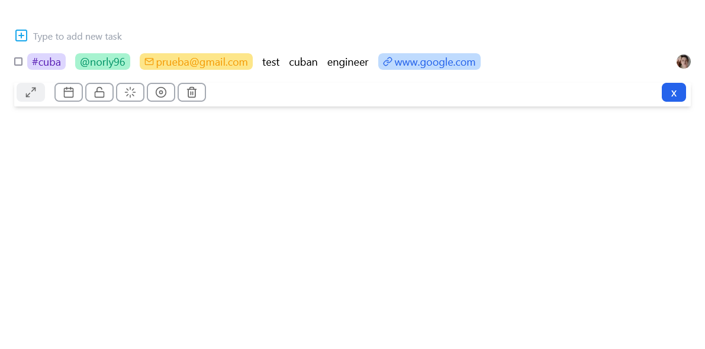
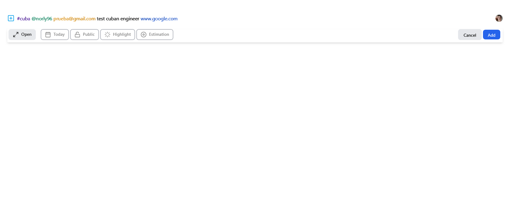

This is a [Next.js](https://nextjs.org/) project bootstrapped with [`create-next-app`](https://github.com/vercel/next.js/tree/canary/packages/create-next-app).

## Getting Started

First, run the development server:

```bash
npm run dev
# or
yarn dev
# or
pnpm dev
# or
bun dev
```

Open [http://localhost:3000](http://localhost:3000) with your browser to see the result.


### Screenshot





### Links

- Solution URL: [GITHUB](https://github.com/norly96/test-cubanengineer)
- Live Site URL: [VERCEL](https://test-cubanengineer.vercel.app/)

## My process

### Built with

- Semantic HTML5 markup
- Flexbox
- NextJS - JS Framework
- Typescript
- [Tailwindcss](https://tailwindcss.com/) - CSS framework
